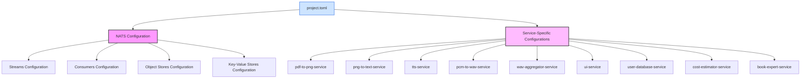

# Project TOML — Centralized Configuration

## Project Summary
Central source of truth for all service configuration (NATS/JetStream, streams/consumers/object stores/KV, and service‑specific settings).

## Detailed Description
This repository provides a single `project.toml` consumed by all services via the `configurator` library. It standardizes NATS and JetStream topology and enforces consistency across services.

Key updates:
- Added `wav_aggregator_service.dead_letter_subject` for DLQ routing.
- Added `[wav-aggregator-service.nats]` with streams, consumers, object stores, and key‑value bucket.
- Services use configurator to create/update streams/consumers/object stores/KV at startup. The wav‑aggregator-service also ensures a DLQ stream exists for the configured subject.

## Technology Stack
- Format: TOML
- Consumers: Go services using `github.com/book-expert/configurator` and `github.com/nats-io/nats.go`
- Messaging: NATS + JetStream

## Getting Started
1) Host `project.toml` somewhere reachable (e.g., GitHub raw URL).
2) Set the environment variable in the service runtime:
   - `export PROJECT_TOML="https://raw.githubusercontent.com/book-expert/project-toml/main/project.toml"`
3) Start a service; it will load config and ensure NATS resources.

## Usage
- Configure Dead‑Letter Subject for wav‑aggregator-service:
  - In `project.toml`:
    - `[wav_aggregator_service]`
      - `dead_letter_subject = "book-expert.wav-aggregator.dlq"`
  - NATS resources:
    - `[wav-aggregator-service.nats]`
      - `streams = [ { name = "wavs", subjects = ["wav.created"] }, { name = "finals", subjects = ["final.audio.created"] }, { name = "dlq", subjects = ["book-expert.wav-aggregator.dlq"] } ]`
      - `consumers = [ { stream_name = "wavs", consumer_name = "wav-aggregator-workers", filter_subject = "wav.created" } ]`
      - `object_stores = [ { bucket_name = "WAV_FILES" }, { bucket_name = "FINAL_AUDIO_FILES" } ]`
      - `key_value = { bucket_name = "WAV_AGGREGATOR_STATE" }`

## Conventions
- Streams: lower-case, descriptive names that group related events (e.g., `pdfs`, `pngs`, `texts`, `wavs`, `finals`, `dlq`).
- Subjects:
  - Prefer fully qualified subjects for cross-service events: `book-expert.<domain>.<event>` (e.g., `book-expert.pngs.created`).
  - Service-local subjects are allowed when scoping is explicit (e.g., `wav.created`, `final.audio.created`).
  - DLQ subjects use: `book-expert.<service>.dlq` (e.g., `book-expert.wav-aggregator.dlq`).
- Consumers: durable queue workers named `<service>-workers` with `AckExplicit` and `filter_subject` set to the consumed subject.
- Object Stores: buckets use UPPER_SNAKE_CASE (e.g., `WAV_FILES`, `FINAL_AUDIO_FILES`). Buckets hold large binaries; events carry only keys.
- KV Buckets: UPPER_SNAKE_CASE that reflects responsibility (e.g., `WAV_AGGREGATOR_STATE`).
- DLQ Stream: dedicated stream `dlq` that includes one or more DLQ subjects sized for peak failure volume.

For the strict implementation blueprint and validation rules, see `../docs/NATS_FOR_AGENTS.md` in the monorepo.

## Testing
- Services should start cleanly with `PROJECT_TOML` set and create/validate streams/consumers/object stores/KV in NATS.
- For a quick check, `curl -fsSL "$PROJECT_TOML"` should return valid TOML.

## Architecture Diagram

## License
Distributed under the MIT License. See the upstream project LICENSE files where applicable.
